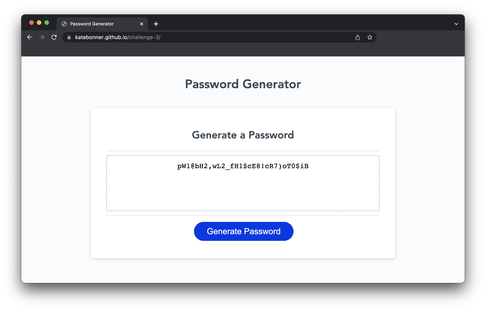

# Columbia University Coding Bootcamp - Password Generator: Challenge 3: 

## Description

This project is a learning assignment derivative of html and css starter code given in the [credits](#credits) section. It is a simple website that contains a password generator. The task at hand was to create a javascript function to generate random passwords given a set of preferences input by the user.


**Copied here is a link to the deployed application:**
(https://katebonner.github.io/random-password-generator/)


## Table of Contents 

* [Installation](#installation)
* [Usage](#usage)
* [Credits](#credits)
* [License](#license)


## Installation

To install this project, navigate to your comand line console (for simplicity we will assume you are using terminal) and:

Create a directory in which this project can live.
```md
mkdir <directory-name>
```
Open the directory you just created.
```md
cd <directory-name>
```
Clone this repository.
```md
git clone git@github.com:katebonner/random-password-generator.git
```
Open the directory you have just created in your code editor of choice either manually or via:
```md
code .
```

## Usage

This project can be used as refrence for a simple javascript function that executes upon a button's click. Additionally, if you choose to build the javascript function, it offers a solution with which you can compare yours.





## Credits

The starter code for this project comes from [https://github.com/coding-boot-camp/friendly-parakeet](https://github.com/coding-boot-camp/friendly-parakeet)

This site was built using [GitHub Pages](https://pages.github.com/).


## License

MIT License

Copyright (c) [2022] [Kate Bonner]

Permission is hereby granted, free of charge, to any person obtaining a copy
of this software and associated documentation files (the "Software"), to deal
in the Software without restriction, including without limitation the rights
to use, copy, modify, merge, publish, distribute, sublicense, and/or sell
copies of the Software, and to permit persons to whom the Software is
furnished to do so, subject to the following conditions:

The above copyright notice and this permission notice shall be included in all
copies or substantial portions of the Software.

THE SOFTWARE IS PROVIDED "AS IS", WITHOUT WARRANTY OF ANY KIND, EXPRESS OR
IMPLIED, INCLUDING BUT NOT LIMITED TO THE WARRANTIES OF MERCHANTABILITY,
FITNESS FOR A PARTICULAR PURPOSE AND NONINFRINGEMENT. IN NO EVENT SHALL THE
AUTHORS OR COPYRIGHT HOLDERS BE LIABLE FOR ANY CLAIM, DAMAGES OR OTHER
LIABILITY, WHETHER IN AN ACTION OF CONTRACT, TORT OR OTHERWISE, ARISING FROM,
OUT OF OR IN CONNECTION WITH THE SOFTWARE OR THE USE OR OTHER DEALINGS IN THE
SOFTWARE.


